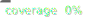

# Koop Output CSV


This is a Koop output plugin that transforms data from Koop Provider into a CSV file.

## Use
The plugin uses highly customizable CSV template in JSON for field mapping with provider's data which can be passed via Koop instance. The options for the plugin are `csvTemplate`, `csvTemplateTransforms` and `csvFileName`. Both `csvTemplate`, `csvTemplateTransforms` can be request (`res.locals`) specific and/or application (`app.locals`) specific set in Koop server middleware. `csvFileName` is request (`res.locals`) specific used for naming CSV filename. 

[adlib](https://github.com/Esri/adlib) is used to interpolate template.


Visit the [KoopJS docs](https://koopjs.github.io/docs/basics/what-is-koop) for instructions on building and deploying a Koop app.

## Develop
```
# clone and install dependencies
git clone https://github.com/koopjs/koopjs-output-csv
cd koopjs-output-csv
npm i

# starts the example Koop app found in ./example-app.
npm run dev
```

## Test
Run the `npm t` commmand to spin up the automated tests.
